<h1>Desafio da Sprint 10 - Dashboards de Análise dos Filmes de Comédia e Animação</h1>

<h2>Objetivo do Desafio</h2>

    Nesta sprint, meu desafio foi modelar e analisar um conjunto de dados refinados e otimizados para
    visualizações analíticas. Com base nesses dados, desenvolvi dashboards no Amazon QuickSight
    para responder perguntas críticas sobre a indústria cinematográfica, abordando a jornada dos filmes desde o investimento até seu impacto financeiro e desempenho.

<h2>Visão Geral do Projeto</h2>

    Este projeto representa o meu progresso desde a <strong>Sprint 6</strong>, onde iniciei a ingestão e organização de dados para a construção de uma arquitetura robusta, até a <strong>Sprint 10</strong>, focando na entrega de insights estratégicos.

<ul>
    <li><strong>Sprint 6:</strong> Ingestão de dados históricos (frios) na nuvem.</li>
    <li><strong>Sprint 7:</strong> Ingestão de dados em tempo real (quentes, via API) na nuvem.</li>
    <li><strong>Sprint 8:</strong> Padronização dos dados na camada RAW (JSON e CSV) para PARQUET e criação da camada TRUSTED.</li>
    <li><strong>Sprint 9:</strong> Tratamento de dados para modelagem dimensional, criando a camada REFINED.</li>
    <li><strong>Sprint 10:</strong> Construção de dashboards estratégicos e análise de dados para decisões mais eficazes.</li>
</ul>

<h2>Ajustes no modelo dimensional:</h2>

Como foi comentado um sobre a modelagem, onde não estava indicado o tipo de cada informação, adicionei a informação

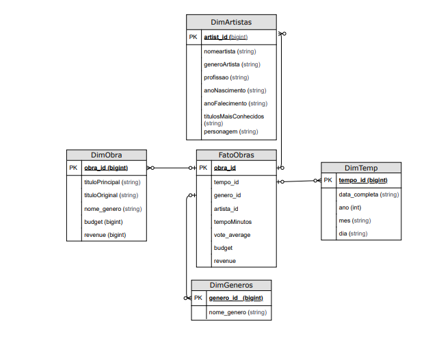
<a href="Modelagem.pdf">Modelo Dimensional PDF</a>

<h2>Ferramentas e Tecnologias</h2>

    Para alcançar os resultados, utilizei as seguintes ferramentas e tecnologias:

<ul>
    <li><strong>AWS QuickSight:</strong> Para visualização de dados com modelagem multidimensional e transformação.</li>
    <li><strong>Amazon Athena:</strong> Para consultas SQL que validam e analisam os dados.</li>
    <li><strong>Amazon S3 e AWS Glue:</strong> Para armazenamento dos dados em formato PARQUET e sua catalogação para acesso otimizado.</li>
</ul>

<h2>Foco da Análise</h2>

    Nesta sprint, foquei nos gêneros <strong>Comédia</strong> e <strong>Animação</strong>, com os seguintes objetivos principais:

<ul>
    <li>Identificar os filmes com melhores avaliações e compreender os fatores do seu sucesso.</li>
    <li>Entender a distribuição de filmes por gênero e a popularidade de estilos específicos.</li>
    <li>Analisar os artistas com maior contribuição na indústria cinematográfica.</li>
    <li>Avaliar a relação entre orçamento e receita, destacando os gêneros mais lucrativos.</li>
</ul>

<h2>Principais Métricas e Insights</h2>
<h3>Análise Crítica e Pontos-Chave:</h3>
<ul>
    <li><strong>Gêneros com maior retorno financeiro:</strong> O gênero Animação se destacou, sugerindo um maior valor entregue para cada dólar investido.</li>
    <li><strong>Anos mais significativos:</strong> Identifiquei tendências marcantes de lançamentos após os anos 1980, influenciadas pela globalização.</li>
    <li><strong>Filmes que surpreenderam:</strong> Analisei obras que superaram expectativas tanto em avaliações quanto em retorno financeiro.</li>
</ul>

<h3>Perguntas Correlacionadas</h3>
<ol>
    <li>Quais são os artistas com maior número de participações em obras, agrupados por gênero?</li>
    <li>Qual é a distribuição dos filmes em cada gênero?</li>
    <li>Quais filmes de Comédia e Animação têm as melhores avaliações?</li>
    <li>Quantos títulos foram lançados em cada ano?</li>
    <li>Qual é a relação entre o orçamento e a receita para cada gênero?</li>
    <li>Quais anos apresentaram o maior número de lançamentos?</li>
    <li>Quais filmes de Animação tiveram o maior lucro (receita - orçamento)?</li>
</ol>

<h2>Dashboards Criados</h2>
<ol>
    <li><strong>Análise de Artistas e Popularidade</strong> (Queries: 1, 2, 3)</li>
    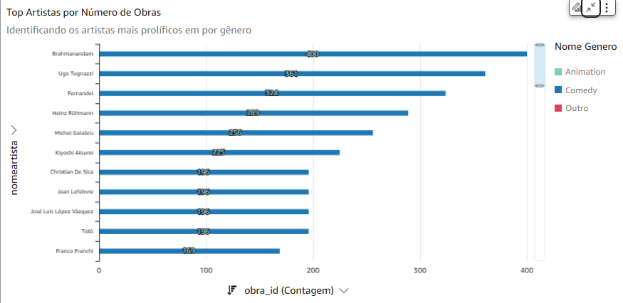
    
Este dashboard visualiza os artistas mais ativos por gênero, permitindo identificar líderes de relevância por estilo.

    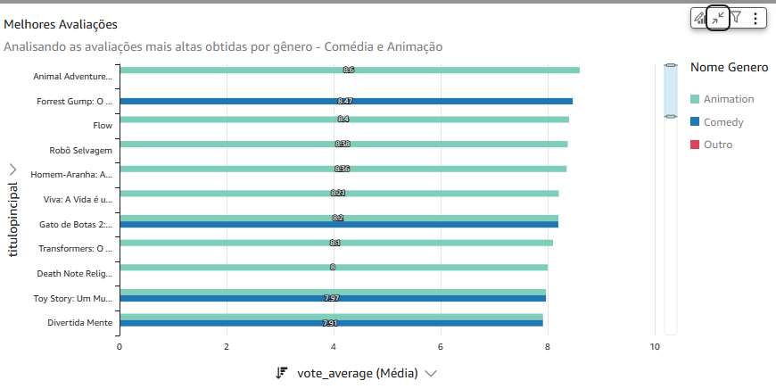
    
Esse gráfico exibe os filmes mais bem avaliados nos gêneros Comédia e Animação, como "Forrest Gump" e "Animal Adventure".

    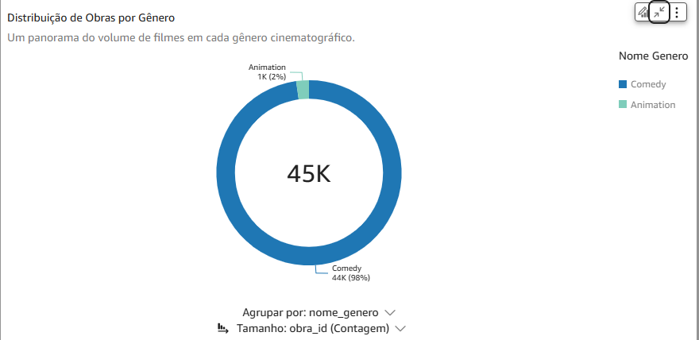
    
Mostrei a popularidade com base no número de lançamentos por gênero. A Comédia lidera em quantidade.

    <li><strong>Análise Temporal</strong> (Queries: 4, 6, 9)</li>
    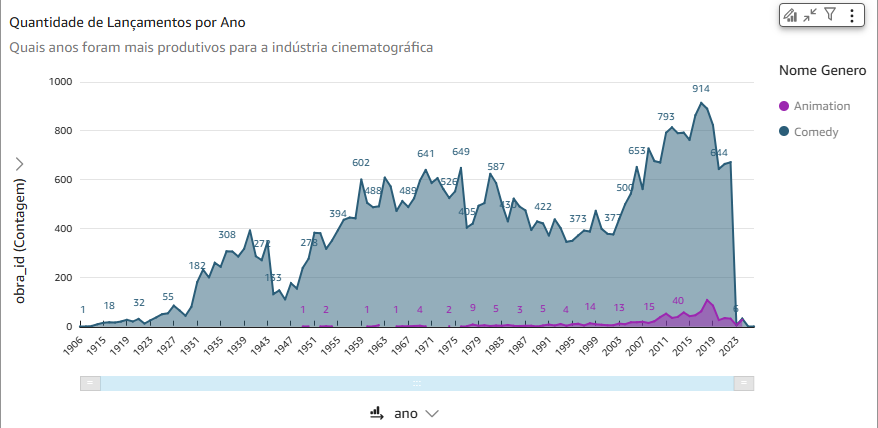
    
Identifiquei tendências de lançamentos anuais, com crescimento acentuado após os anos 1980.

    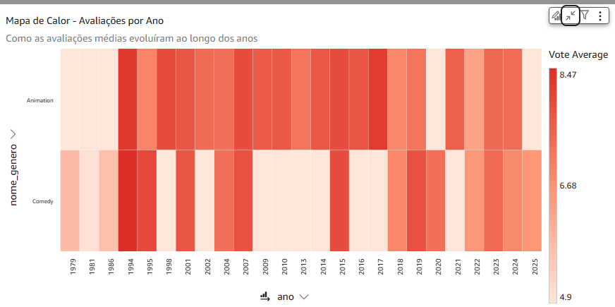
    
Este dashboard evidencia picos de avaliação de filmes ao longo das décadas.

    <li><strong>Análise Financeira</strong> (Queries: 5, 7, 8, 10, 11)</li>
    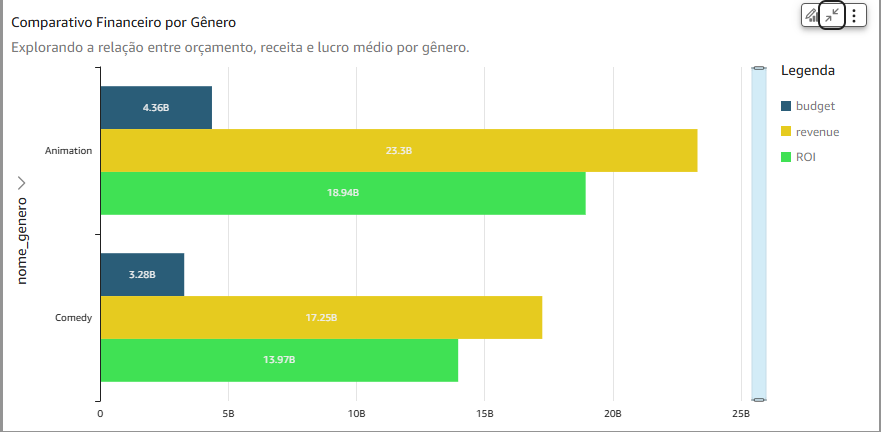
    
Gêneros como Animação geram maior retorno financeiro, reforçando sua viabilidade como investimento.

    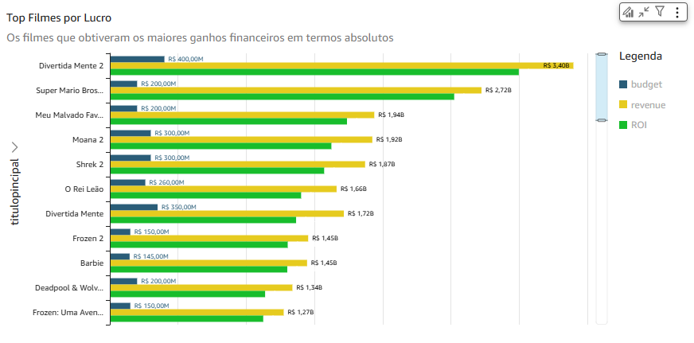
    
O ranking inclui obras como "Divertidamente 2", que demonstraram lucros altos devido a estratégias assertivas de orçamento.

</ol>
<a href="../Desafio/Dashboards.pdf">Dashboards PDF</a>

<h2>Catálogo e Armazenamento de Dados</h2>

    Armazenei os dados no Amazon S3 em formato <strong>PARQUET</strong>, usando o <strong>AWS Glue</strong> para catalogação. Analisei essas informações no <strong>Amazon Athena</strong>, garantindo validações robustas.

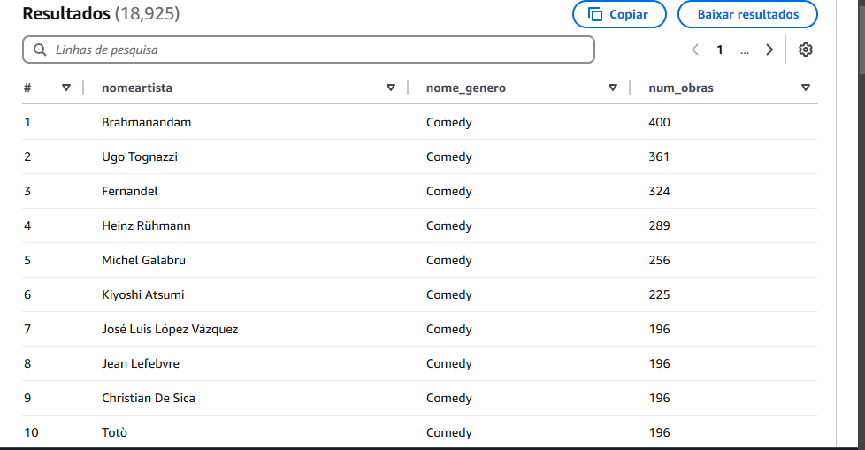
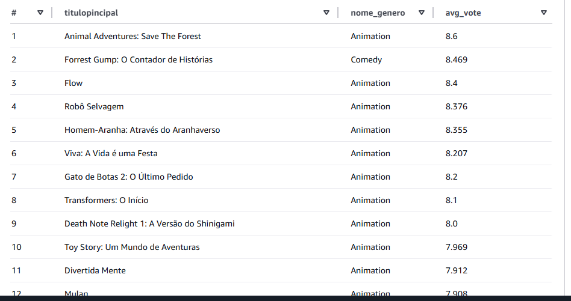

Conjunto de dados:

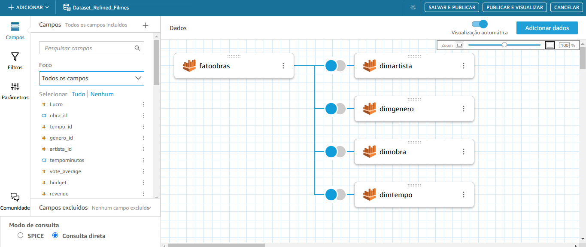

Exemplo coluna calculada:

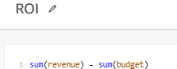

<h2>Conclusão</h2>

    Os dashboards que criei proporcionam uma visão estratégica dos gêneros Comédia e Animação,
    destacando tendências financeiras, avaliações e relevância temporal. Esse trabalho reforça a importância da análise de dados como uma ferramenta essencial para decisões estratégicas no setor cinematográfico.

