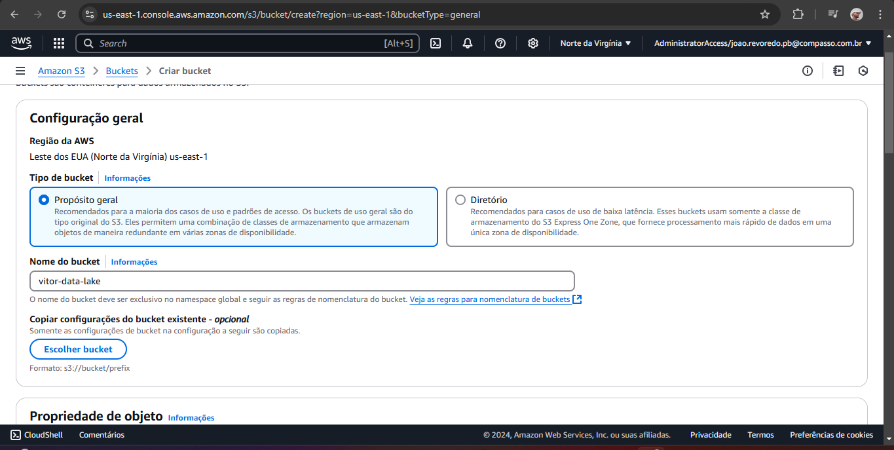

<h1>Desafio do S3 com Python</h1>  

Este projeto é dividido em cinco etapas, sendo a primeira focada no envio automatizado de dois arquivos CSV (Filmes e Séries) para um bucket na AWS S3. Além disso, foram levantadas perguntas para análise futura dos dados.
  

<ul>  
  
As principais ferramentas utilizadas foram:
  
  <li><strong>AWS S3:</strong> Armazenamento e gerenciamento dos arquivos no Data Lake.</li>  
  <li><strong>Python (bibliotecas):</strong></li>  
  <ul>
    <li><strong>Boto3:</strong> Interação com os serviços da AWS.</li>  
    <li><strong>OS:</strong> Manipulação de caminhos de arquivos.</li>  
    <li><strong>Dotenv:</strong> Carregamento de variáveis de ambiente a partir de arquivos .env.</li>  
  </ul>
</ul>  

<h2>Estrutura dos Dados</h2>  
<strong>Filmes:</strong> Contém informações como título, gênero, data de lançamento e personagens.   
<strong>Séries:</strong> Similar aos filmes, mas com dados específicos de séries de TV.  

<h2>Perguntas para Análise dos Dados</h2>  
<ol>  
  <li>Quais artistas (atores ou diretores) têm mais obras conhecidas nos gêneros Comédia e Animação?</li>  
  <li>Quais anos apresentaram o maior número de lançamentos em comédia e animação?</li>  
  <li>Quais filmes ou séries de comédia e animação têm o maior número de votos em relação à nota média?</li>  
  <li>Qual é o tempo médio de duração de filmes de comédia em comparação com animações?</li>  
</ol>  

<h2>Credenciais AWS</h2>  

Para proteger as credenciais de acesso à AWS, utilizei um arquivo .env, que armazena variáveis de ambiente de forma segura. Essa abordagem evita que as credenciais sejam incluídas diretamente no código-fonte, reduzindo o risco de exposição. Também utilizei o .gitignore para evitar que essas informações sejam publicadas no GitHub.
  

  
<a href="/Sprint-6/Desafio/.env.example">Exemplo da estrutura do .env</a>  

<h2>Passo a Passo para Resolução do Desafio</h2>  

Comecei criando o bucket no S3 para armazenar os arquivos:
  
  

Configurei uma role de acesso ao bucket para permitir o acesso:
  
  

Em seguida, criei o script em Python para fazer o upload dos arquivos:
  

O script carrega variáveis de ambiente utilizando o arquivo <strong>.env</strong>. Ele interage com o S3 via boto3 e cria uma estrutura hierárquica de pastas baseada na data atual (formato ano/mês/dia). O envio dos arquivos movies.csv e series.csv foi testado inicialmente sem o Docker para ajustes e validações.
  

  

Configurei um ambiente de teste com o AWS CLI para validar o envio do script:
  
  
  

O script automatiza o envio de arquivos para o AWS S3, organizando-os de acordo com a data atual. Ele faz uso das bibliotecas Python para garantir uma integração segura e eficiente.
  
  

<strong>Após os testes, excluí os arquivos e preparei o ambiente para criação do Dockerfile.</strong>
  
  

Link para o script:
  
<ul>  
  <li><a href="./Sprint-6/Desafio/upload_s3.py">Script Python</a></li>  
</ul>  

<h2>Dockerfile</h2>  

O Dockerfile foi configurado para criar o ambiente Python, instalar as dependências necessárias e executar o script Python para enviar os arquivos para o S3.
  
  

<ul>  
  <li><strong>Imagem Base:</strong> Usa a imagem oficial do Python 3.9.</li>  
  <li><strong>Diretório de Trabalho:</strong> Define o diretório /app onde os arquivos serão copiados.</li>  
  <li><strong>Instalação de Dependências:</strong> Instala as bibliotecas boto3, pandas e python-dotenv.</li>  
  <li><strong>Execução do Script:</strong> Define o comando para rodar o script Python upload_s3.py.</li>  
</ul>  

<h2>Comandos de Execução do Docker</h2>  

Criando a imagem Docker:
  
<pre><code>docker build -t vitor-docker .</code></pre>  

O comando para executar o container Docker. O arquivo .env é passado como parâmetro para garantir que as variáveis de ambiente sejam carregadas corretamente:
  
  
<pre><code>docker run -it --env-file C:\Users\Vitor\Documents\Vitor\PB-JOAO-VITOR-DE-MELO-REVOREDO\Sprint-6\Desafio\.env -v C:\Users\Vitor\Documents\Vitor\PB-JOAO-VITOR-DE-MELO-REVOREDO\Sprint-6\Desafio:/app vitor-docker</code></pre>  

Exemplo de erro encontrado:
  
  

<h2>Conclusão</h2>  

Este projeto foi de grande importância para entender como utilizar o AWS S3 para criar e gerenciar um Data Lake. O uso do Docker possibilitou criar um ambiente isolado e portátil, garantindo que o código Python fosse executado de maneira consistente. Isso facilita o armazenamento e a análise de grandes conjuntos de dados no futuro.
  
