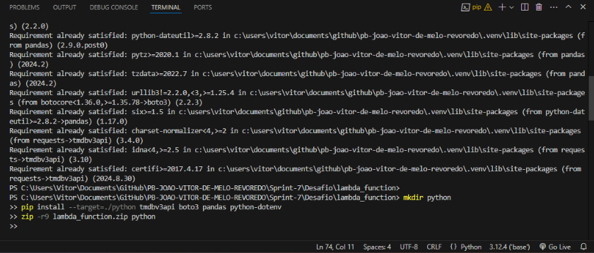
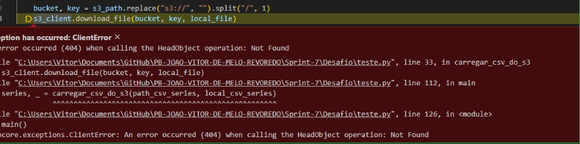

<h1>Desafio da Sprint 7 - TMDB com AWS</h1>

Esta sprint focou na extração e armazenamento de dados adicionais provenientes da API TMDB para complementar as informações já presentes no Data Lake. O principal objetivo foi buscar e organizar dados de filmes e séries de maneira eficiente e segura, utilizando AWS Lambda, boto3 e outras ferramentas essenciais.

<ul>
  
As principais ferramentas utilizadas foram:

  <li><strong>AWS S3:</strong> Armazenamento e gerenciamento dos arquivos JSON na camada Raw Zone do Data Lake.</li>
  <li><strong>AWS Lambda:</strong> Execução automatizada de funções para integração com a API TMDB.</li>
  <li><strong>Python (bibliotecas):</strong></li>
  <ul>
    <li><strong>Boto3:</strong> Interação com os serviços da AWS.</li>
    <li><strong>Tmdbv3api:</strong> Consumo da API TMDB para extração de dados.</li>
  </ul>
</ul>

<h2>Estrutura dos Dados</h2>

<strong>API TMDB:</strong> Os dados extraídos incluem informações detalhadas sobre filmes relacionados aos gêneros Comédia e Animação.

<h2>Perguntas para Análise dos Dados</h2>
<ol>
  <li>Quais filmes e séries possuem o maior número de votos nos gêneros Comédia e Animação?</li>
  <li>Quais são os diretores ou atores mais recorrentes nesses gêneros?</li>
  <li>Como o número de lançamentos variou ao longo dos anos para filmes e séries nesses gêneros?</li>
  <li>Há diferenças notáveis na duração de filmes de Comédia em comparação às Animações?</li>
</ol>

<h2>Credenciais e Segurança</h2>

Para proteger as credenciais de acesso à API do TMDB e à AWS, foi utilizado um arquivo .env para os testes locais. Já no Lambda, variáveis de ambiente foram usadas para armazená-las de forma segura.

<h2>Passo a Passo do Desafio</h2>

Comecei fazendo um script de testes locais para estruturar o arquivo e as requisições desejadas com a API do <strong>TMDB</strong>. Fiz alguns testes de execução:

  

Arquivos salvos no S3 nos testes:

  

Finalizei o script para extração e upload automatizado de arquivos JSON agrupados no Amazon S3.

Criação da função Lambda:

 

Criei um arquivo com as bibliotecas necessárias para rodar no Lambda:

 
<a href="./libs_lambda.zip">Libs Lambda</a>

Carreguei o ZIP com as bibliotecas:

Evidências de execução concluída no Lambda:

 

Arquivos salvos via função Lambda:

 

O padrão de path para organização dos arquivos foi:

<pre><code>S3://vitor-data-lake/Raw/TMDB/JSON/<ano>/<mês>/<dia>/<nome_do_arquivo>.json</code></pre>

 
<a href="./lambda_function.py">Script utilizado no AWS lambda</a>
<h2>Exemplos de Alguns Erros Encontrados</h2>

Durante o desenvolvimento do script, realizei vários testes e modificações até atender os requisitos do desafio:

No Lambda, enfrentei problemas com as bibliotecas. O serviço não identificava a camada corretamente. Tive que modificar o arquivo ZIP algumas vezes para garantir que as bibliotecas estavam na camada principal que o Lambda consegue executar:

<h2>Resultados Obtidos</h2>

Dados adicionais relevantes foram armazenados na camada Raw Zone do Amazon S3 em conformidade com os requisitos de tamanho e organização.

  

Arquivos JSON com dados complementares estão prontos para serem utilizados nas etapas seguintes do projeto.

<h2>Explicação das perguntas para Análise dos Dados</h2>  
<ol>  
  <li>Quais artistas (atores ou diretores) têm mais obras conhecidas nos gêneros Comédia e Animação?</li>
   <strong>Minha ideia é cruzar os dados obtidos da TMDb (como elencos e diretores de filmes) com os gêneros indicados nos arquivos CSV ou retornos da API.</strong>
  <li>Quais anos apresentaram o maior número de lançamentos em comédia e animação?</li>
  <strong>Minha ideia é identificar picos de popularidade ou produção de conteúdos nesses gêneros.</strong>
  <li>Quais filmes ou séries de comédia e animação têm o maior número de votos em relação à nota média?</li> 
  <strong>Os retornos da API TMDb incluem métricas como vote_count e vote_average.</strong>
  <li>Qual é o tempo médio de duração de filmes de comédia em comparação com animações?</li> 
  <strong>Explorar peculiaridades de ambos os gêneros e identificar tendências.</strong>
</ol>  

<h2>Conclusão</h2>

Essa etapa permitiu ampliar a qualidade dos dados disponíveis para análise posterior. O foco nas boas práticas de armazenamento e segurança manteve a organização necessária no Data Lake.

