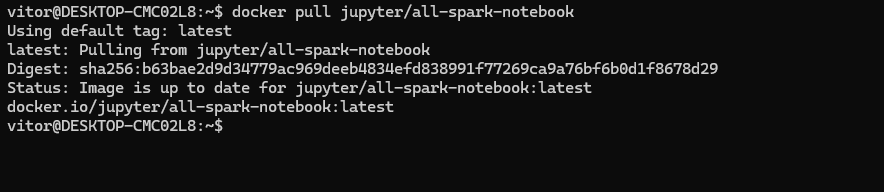
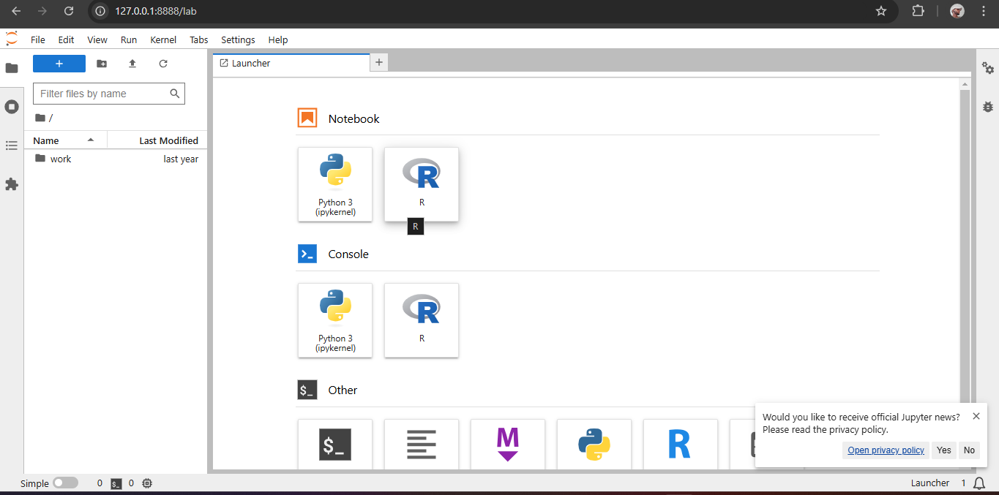
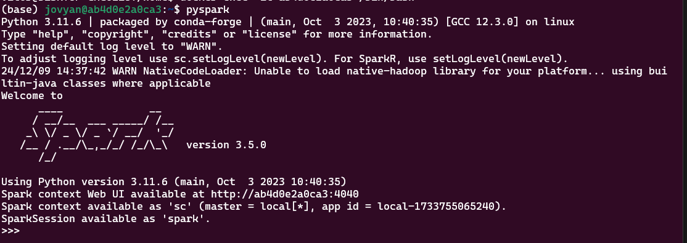
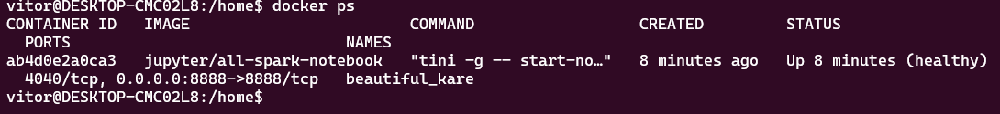
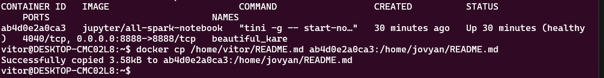
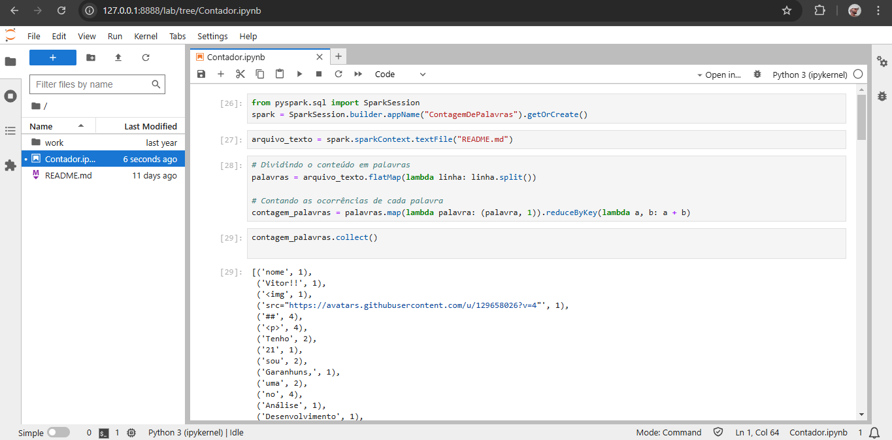
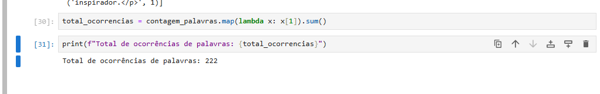
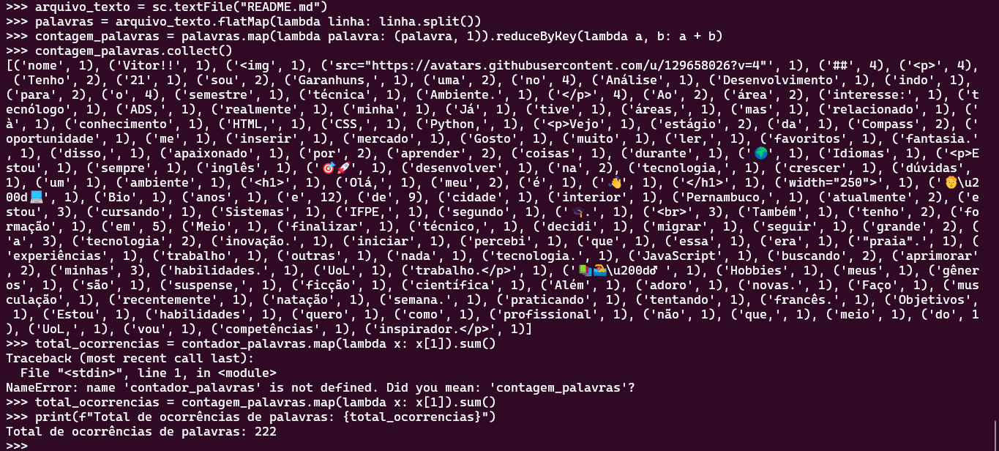

<h1>README - Sprint 7</h1>

<h2>Descrição</h2>

Nesta Sprint, foram realizadas extrações de dados complementares utilizando a API do TMDB. As informações capturadas complementam os dados de filmes e séries carregados na camada Raw Zone do Amazon S3 durante a Sprint 6, além de incluir exercícios de prática de processamento de dados com Spark e AWS Glue.

<h2>Objetivos da Sprint</h2>
<ul>
  <li>Buscar dados adicionais para enriquecer a análise final.</li>
  <li>Entender como realizar processamento de dados em larga escala utilizando o Spark, especificamente para contar a quantidade de ocorrências de cada palavra no arquivo.</li>
  <li>Realizar a ingestão, transformação e carregamento de dados no AWS S3 e no AWS Glue Data Catalog.</li>
</ul>

<h2>Exercícios</h2>

<h3>PySpark</h3>

Primeiramente, fiz o pull da imagem <code>jupyter/all-spark-notebook</code> do Docker, que já vem com o Spark e o Jupyter Lab pré-instalados.

 

Depois de obter a imagem, criei e rodei o container com a flag <code>-it</code> para permitir o modo interativo. Ao iniciar o container, fui redirecionado para um link gerado automaticamente, que me deu acesso ao Jupyter Lab diretamente no meu navegador.

<pre><code>docker run -it -p 8888:8888 jupyter/all-spark-notebook</code></pre>

Em outro terminal do container, executei o comando <code>pyspark</code> com as flags <code>-i</code> e <code>-t</code> para iniciar o <strong>SparkShell</strong> e ficar com um terminal interativo do Spark disponível.

Fiz uma cópia do meu arquivo do <strong>Readme</strong> para o container utilizando seu ID para gerar e testar o contador de palavras:

<a href="../README.md">Readme utilizado</a>

Fiz os testes do contador de palavras no Jupyter:

 
<a href="./Exercicios/Contador_pyspark.ipynb">Notebook do contador</a>

Em seguida, executei no Pyspark para confirmar os resultados:

A execução do Spark dentro de um container Docker, junto com o uso do Jupyter Notebook, proporcionou uma boa oportunidade para aprender como trabalhar com dados em larga escala de maneira simples e eficiente.

<h3>AWS Glue</h3>

Primeiramente, criei uma IAM Role chamada <code>AWSGlueServiceRole-Lab4</code>, que foi associada às seguintes permissões:

<ul>
  <li>AmazonS3FullAccess</li>
  <li>AWSLakeFormationDataAdmin</li>
  <li>AWSGlueConsoleFullAccess</li>
  <li>CloudWatchFullAccess</li>
</ul>

Após configurar a IAM Role, fiz as modificações necessárias para associar as permissões ao serviço <strong>AWS Glue</strong> por meio da opção "Set up roles and users" no console do Glue. Assim, garanti que o Glue teria permissões de leitura e gravação no S3.

No <strong>AWS Lake Formation</strong>, criei um banco de dados chamado <code>glue-lab</code> que seria utilizado para registrar os metadados dos dados processados no S3. Essa etapa é crucial, pois o Lake Formation ajuda a criar e organizar catálogos de dados que podem ser usados pelos crawlers para automação de tarefas.

Para processar o arquivo <code>nomes.csv</code>, criei um ETL Job no Glue utilizando a opção "Visual ETL" e selecionei o engine Spark.
 

Defini as seguintes configurações para o job:

<ul>
  <li>Nome: job_aws_glue_lab_4</li>
  <li>IAM Role: AWSGlueServiceRole-Lab4</li>
  <li>Engine: Spark</li>
  <li>Glue Version: Glue 3.0</li>
  <li>Language: Python 3</li>
  <li>Workers: 2, com G1x (menor vCPU e RAM)</li>
  <li>Timeout: 5 minutos</li>
</ul>
<strong>Executando job:</strong>

No código do script, segui as etapas descritas abaixo para transformar os dados e realizar os carregamentos.

O script que desenvolvi foi baseado no modelo do Glue, utilizando os <strong>DynamicFrames</strong> para a ingestão dos dados. As etapas do processo de transformação seguiram a estrutura abaixo:

<strong>Leitura do CSV:</strong> Leitura do arquivo <code>nomes.csv</code> a partir do S3.

<pre><code>nomes_df = glueContext.create_dynamic_frame.from_catalog(database = "glue-lab", table_name = "nomes")</code></pre>

<strong>Impressão do schema:</strong> O código foi estruturado para imprimir o schema do dataframe e garantir que os dados foram lidos corretamente.

<pre><code>nomes_df.printSchema()</code></pre>

<strong>Alteração de caixa:</strong> Transformação para converter o campo <code>nome</code> para letras maiúsculas.

<pre><code>from pyspark.sql.functions import upper 
nomes_df = nomes_df.toDF().withColumn("nome", upper(nomes_df["nome"]))</code></pre>

<strong>Contagem de Linhas:</strong> O código conta o número de registros após a transformação.

<pre><code>print(f"Contagem de registros: {nomes_df.count()}")</code></pre>

<strong>Contagem de Nomes por Ano e Sexo:</strong> Agrupamento dos dados por ano e sexo, ordenados por ano.

<pre><code>nomes_agrupados = nomes_df.groupBy("ano", "sexo").count().orderBy("ano", ascending=False)
nomes_agrupados.show()</code></pre>

<strong>Nome feminino e masculino mais registrado:</strong> Identificação dos nomes mais comuns. Ex:

<pre><code>nome_feminino_max = nomes_df.filter(nomes_df["sexo"] == "F").groupBy("nome", "ano").count().orderBy("count", ascending=False).first()
print(f"Nome feminino com mais registros: {nome_feminino_max['nome']} no ano {nome_feminino_max['ano']}")</code></pre>

<strong>Total de Registros por Ano:</strong> Exibição do total de registros por ano.

<pre><code>registros_por_ano = nomes_df.groupBy("ano").count().orderBy("ano", ascending=True).limit(10)
registros_por_ano.show()</code></pre>

<strong>Escrita no S3 em formato JSON:</strong> Os dados com a coluna nome em maiúsculo foram escritos de volta no S3 em formato JSON e particionados pelas colunas sexo e ano.

<pre><code>nomes_df.write.partitionBy("sexo", "ano").json("s3://lab-glue/frequencia_registro_nomes_eua/")</code></pre>

Após processar os dados e gravar o arquivo JSON no S3, criei um Crawler no AWS Glue para automatizar a criação dos metadados no catálogo do Glue.

Configurei o Crawler para acessar o caminho <code>s3://lab-glue/frequencia_registro_nomes_eua/</code> e utilizá-lo para descobrir e catalogar os dados. O Crawler foi configurado para rodar sob demanda e gerar a tabela chamada <code>frequencia_registro_nomes_eua</code> no banco de dados <code>glue-lab</code>.

<h2>Certificados</h2>

Essa Sprint não teve cursos AWS, fiz alguns cursos pela Udemy para me aprofundar no assunto.

<h2>Comentários Finais</h2>

Esta Sprint foi essencial para entender a integração entre Python, processamento de dados e serviços AWS, consolidando a integração de tecnologias essenciais para o projeto e abriu caminhos para as próximas etapas.

