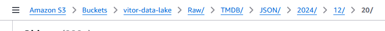
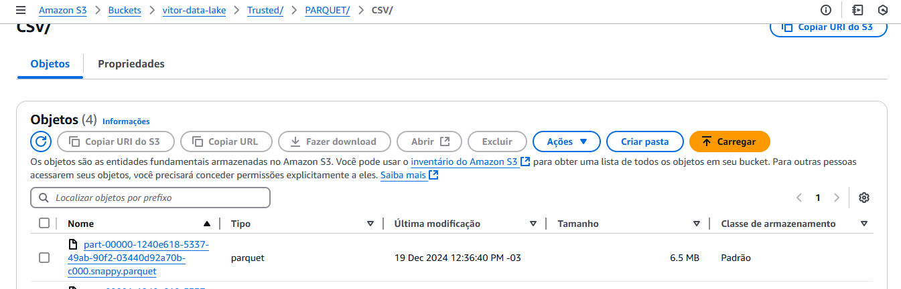
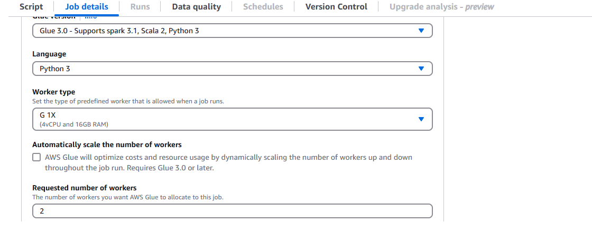
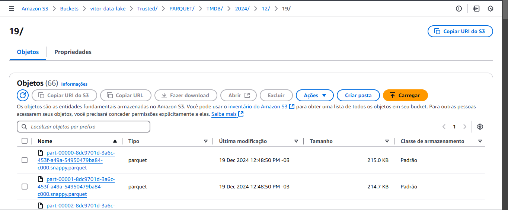
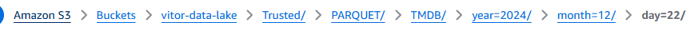
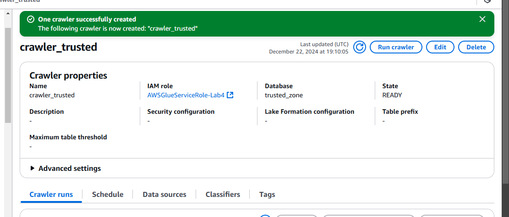
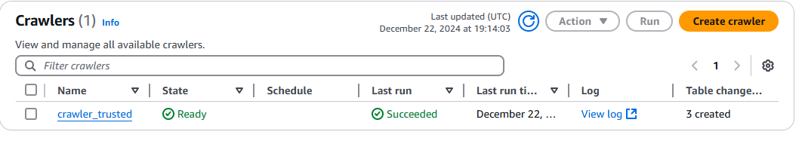
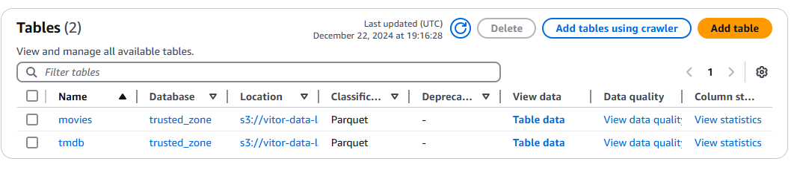
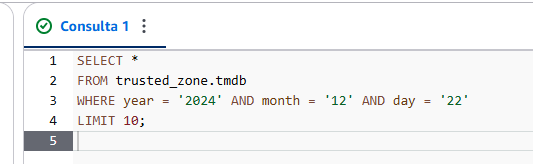
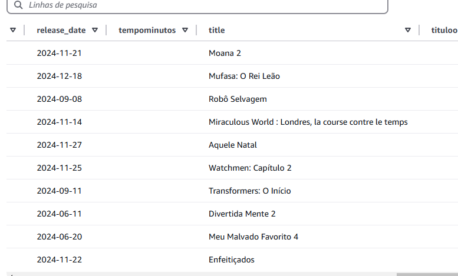

<h1>Desafio da Sprint 8 - Processamento da Camada Trusted</h1>

Esta sprint teve como foco principal o processamento e a padronização dos dados para a camada Trusted do Data Lake. O objetivo foi garantir que os dados provenientes da camada Raw estivessem confiáveis e organizados, utilizando Apache Spark para leituras, validações e gravações em formato PARQUET na Trusted Zone.

As principais ferramentas e tecnologias utilizadas nesta sprint foram:

<ul>
  <li><strong>AWS Glue:</strong> Processamento de dados em larga escala e transformações.</li>
  <li><strong>Amazon S3:</strong> Armazenamento e gerenciamento dos arquivos processados.</li>
  <li><strong>Amazon Athena:</strong> Consultas e validações dos dados salvos na camada Trusted.</li>
</ul>

<h2>Estrutura dos Dados</h2>

O foco principal desta sprint foi nos arquivos CSV e JSON carregados anteriormente na camada Raw. Esses dados foram transformados e padronizados para a Trusted Zone.

<h2>Critérios de Limpeza e Confiabilidade</h2>

Como decidi focar minha análise em filmes dos gêneros Comédia e Animação, apliquei os seguintes critérios de limpeza para garantir maior confiabilidade nos dados:

<ul>
  <li><strong>Verificação e remoção de linhas com campos incompletos ou inconsistentes:</strong>
    <ul>
      <li>Linhas com valores nulos (\N ou vazios).</li>
      <li>Campos importantes, como <code>id</code>, <code>tituloPrincipal</code> e <code>anoLancamento</code>, foram considerados obrigatórios.</li>
    </ul>
  </li>
  <li><strong>Validação e padronização de campos específicos:</strong>
    <ul>
      <li>Confirmar que <code>anoLancamento</code> tem apenas números válidos.</li>
      <li>Garantir que <code>genero</code> esteja categorizado corretamente.</li>
    </ul>
  </li>
  <li><strong>Filtragem e ajuste de dados sobre pessoas e personagens:</strong>
    <ul>
      <li>Verificar se campos como <code>anoNascimento</code> ou <code>anoFalecimento</code> fazem sentido e padronizar o formato, removendo valores inválidos (\N).</li>
    </ul>
  </li>
</ul>

<h2>Passo a Passo do Desafio</h2>

Comecei reexecutando a função Lambda para trazer os dados atualizados para o TMDB:

Para o processamento, comecei configurando o job para o arquivo CSV:

 

Fui realizando os ajustes até chegar na versão final do código:  
<a href="../Desafio/processamento_csv.py">Processamento CSV</a>

Por fim, os dados foram gravados na camada Trusted:

 

Para os arquivos JSON:

 

Apliquei os mesmos princípios de limpeza, focando nos critérios específicos para esse formato de arquivo:

<a href="../Desafio/processamento_tmdb.py">Processamento TMDB</a>

Os dados limpos também foram salvos na camada Trusted em formato PARQUET:

 

<h2>Evidências</h2>

A estrutura dos dados no Amazon S3 foi mantida conforme planejado, com particionamento baseado na data de processamento:

<pre><code>s3://vitor-data-lake/Trusted/PARQUET/&lt;arquivo&gt;/&lt;ano&gt;/&lt;mês&gt;/&lt;dia&gt;</code></pre>

  

Em seguida, criei um crawler para persistir os dados no Catálogo do Glue e o executei:

Tabelas criadas:

Realizei alguns testes de pesquisa no Athena:

Obtive os seguintes resultados:

<h2>Conclusão</h2>

Essa etapa foi fundamental para garantir que os dados disponíveis na Trusted Zone estejam confiáveis, organizados e prontos para as próximas etapas de análise. A limpeza e padronização aplicadas ajudam a manter a qualidade e a eficiência nos processos futuros do projeto.

