<h1>README - Sprint 8</h1>

<h2>Descrição</h2>

Nesta Sprint, o foco foi a geração de dados simulados e a aplicação de transformações usando o Apache Spark para processamento e manipulação desses dados. Além disso, foi explorado o uso de consultas SQL no Spark, integração com o AWS Glue para limpeza de dados e preparação para o armazenamento eficiente. O processo também incluiu a configuração da API do TMDB, que servirá para complementar a análise futura no projeto, conforme as próximas etapas de ingestão e processamento.

<h2>Objetivos da Sprint</h2>
<ul>
  <li>Gerar dados simulados para posterior processamento e análise.</li>
  <li>Entender como utilizar o Apache Spark para transformar, manipular e processar grandes volumes de dados.</li>
  <li>Realizar integrações com o AWS Glue para transformar dados e preparar para o carregamento na camada Trusted do Data Lake.</li>
</ul>

<h2>Gerador de Massa de Dados</h2>
<ol>
    <li>
        <h3>Geração de 250 Números Aleatórios</h3>
        <ul>
            <li>Utilizado <code>random</code> para criar números aleatórios entre 1 e 1000.</li>
            <li>Lista invertida com <code>reverse()</code> e exibida no console.</li>
        </ul>
        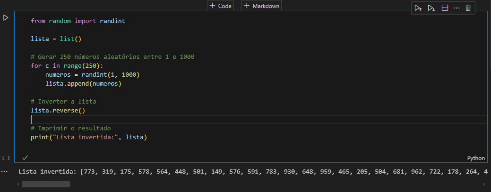
    </li>
    <li>
        <h3>Lista de Nomes de Animais</h3>
        <ul>
            <li>Ordenação alfabética de 20 nomes de animais.</li>
            <li>Arquivo gerado <code>animais.csv</code> com os nomes.</li>
        </ul>
        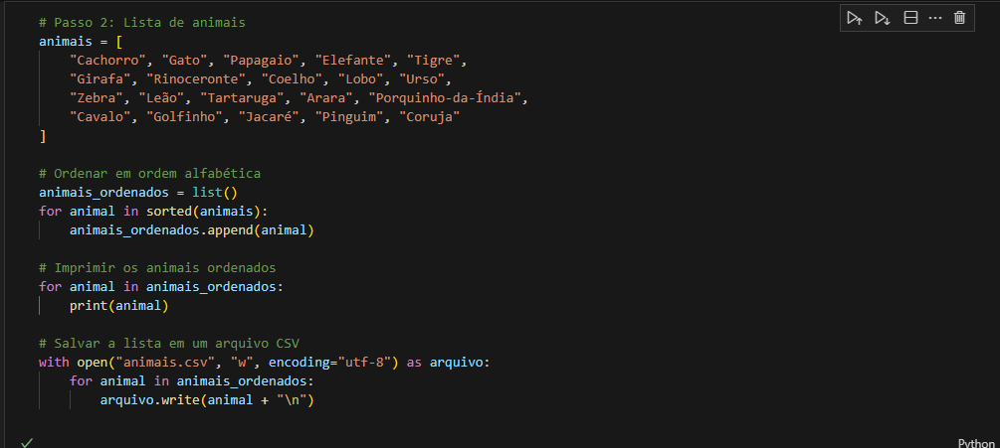
    </li>
    <li>
        <h3>Geração de Dataset de Nomes Aleatórios</h3>
        <ul>
            <li>Geração de 10 milhões de nomes aleatórios usando <code>names</code> e <code>random</code>.</li>
            <li>Resultado salvo em <code>nomes_aleatorios.txt</code>.</li>
        </ul>
        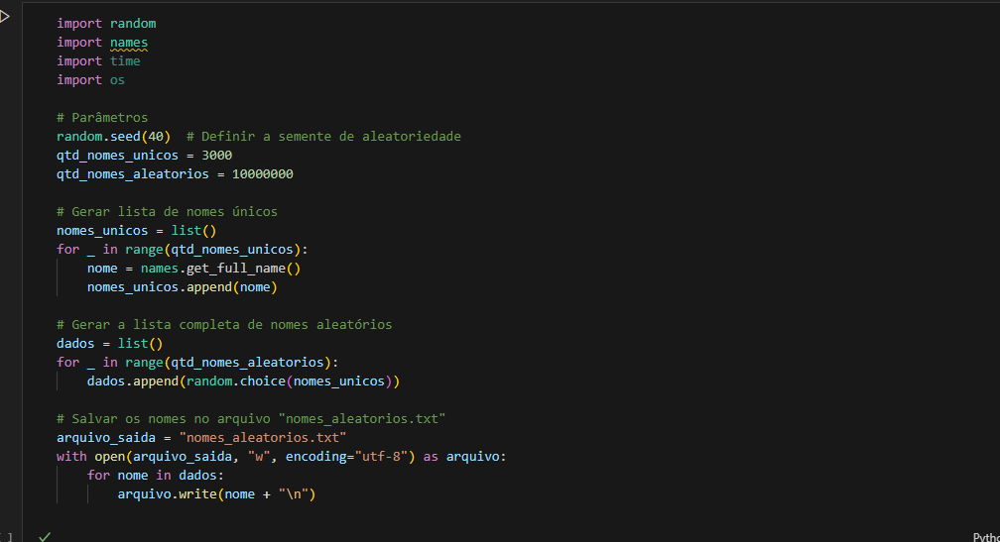
    </li>
    <li>
        <h3>Leitura e Verificação do Arquivo</h3>
        <ul>
            <li>Leitura do arquivo <code>nomes_aleatorios.txt</code> e exibição das primeiras 10 linhas no console.</li>
        </ul>
        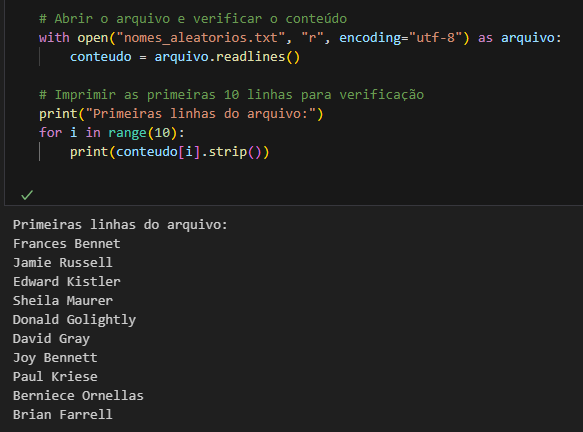
    </li>
</ol>

<h2>Arquivos Gerados</h2>
<ul>
    <li><a href="./Exercicios/Gerador-massa-dados/animais.csv">CSV de Nomes de Animais</a></li>
    <li><a href="./Exercicios/Gerador-massa-dados/nomes_aleatorios.txt">Arquivo TXT com Nomes Aleatórios</a></li>
    <li><a href="./Exercicios/Gerador-massa-dados/gerador.ipynb">Notebook Python</a></li>
</ul>

<h2>Processamento com Apache Spark</h2>
<ol>
    <li>
        <h3>Leitura do Arquivo <code>nomes_aleatorios.txt</code></h3>
        <ul>
            <li>Arquivo carregado no DataFrame <code>df_nomes</code> usando <code>spark.read.csv</code>.</li>
            <li>Exibição das primeiras 5 linhas com <code>show(5)</code>.</li>
        </ul>
        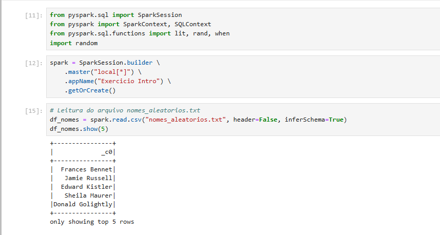
    </li>
    <li>
        <h3>Renomeação de Coluna e Verificação do Esquema</h3>
        <ul>
            <li>Coluna renomeada para <code>Nomes</code> e exibição do esquema com <code>printSchema()</code>.</li>
        </ul>
        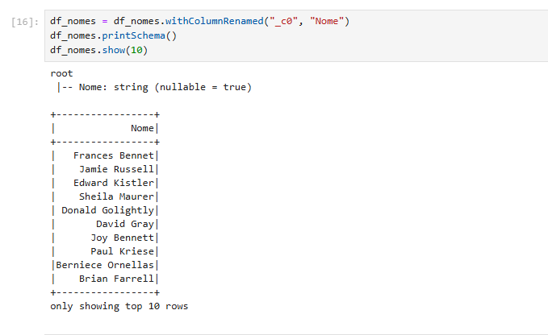
    </li>
    <li>
        <h3>Adição das Colunas <code>Escolaridade</code> e <code>País</code></h3>
        <ul>
            <li>Coluna <code>Escolaridade</code> com valores aleatórios e adição de <code>País</code> com 13 países.</li>
        </ul>
        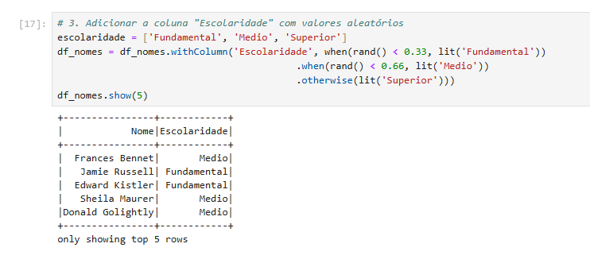
        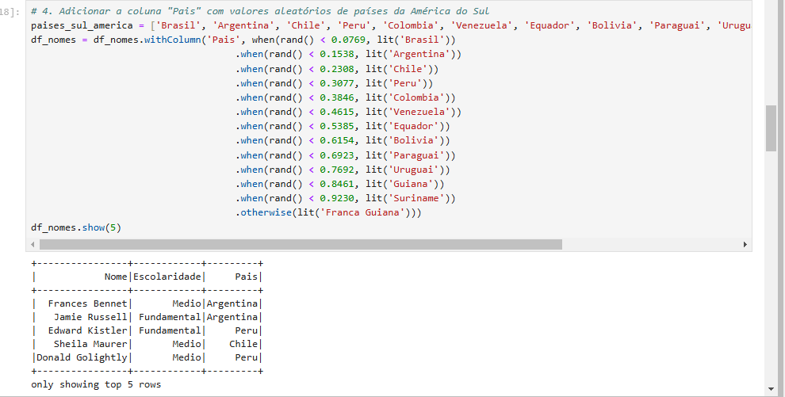
    </li>
    <li>
        <h3>Adição da Coluna <code>AnoNascimento</code> e Filtragem</h3>
        <ul>
            <li>Adicionada a coluna <code>AnoNascimento</code> e filtrados nomes nascidos a partir de 2000.</li>
        </ul>
        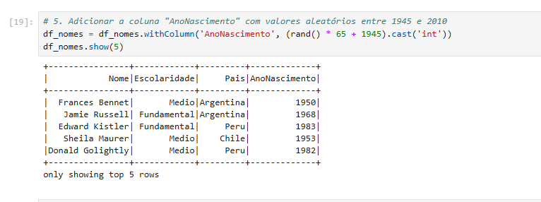
        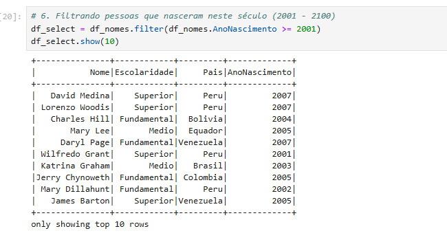
    </li>
    <li>
        <h3>Consultas SQL e Filtragem de Gerações</h3>
        <ul>
            <li>Consulta Spark SQL para agrupar pessoas por geração e país. Contagem dos nascidos entre 1980 e 1994.</li>
        </ul>
        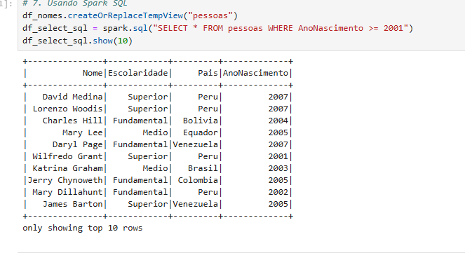
        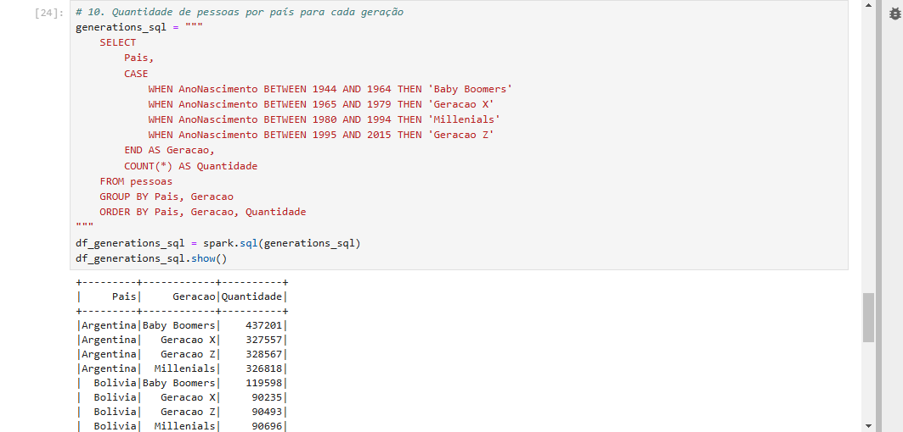
    </li>
</ol>

<h2>Arquivos Gerados</h2>
<ul>
    <li><a href="./Exercicios/Apache-spark/manipulacaoSpark.ipynb">Script Python Spark</a></li>
</ul>

<h2>TMDB</h2>

Comecei criando minha conta no TMDB, seguindo as instruções necessárias.

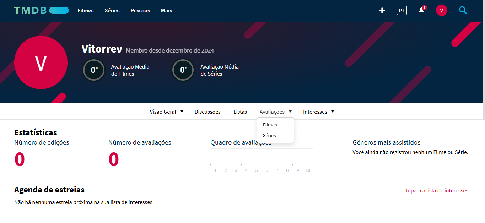

Criei minha credencial de uso da API, que permite o acesso às requisições:

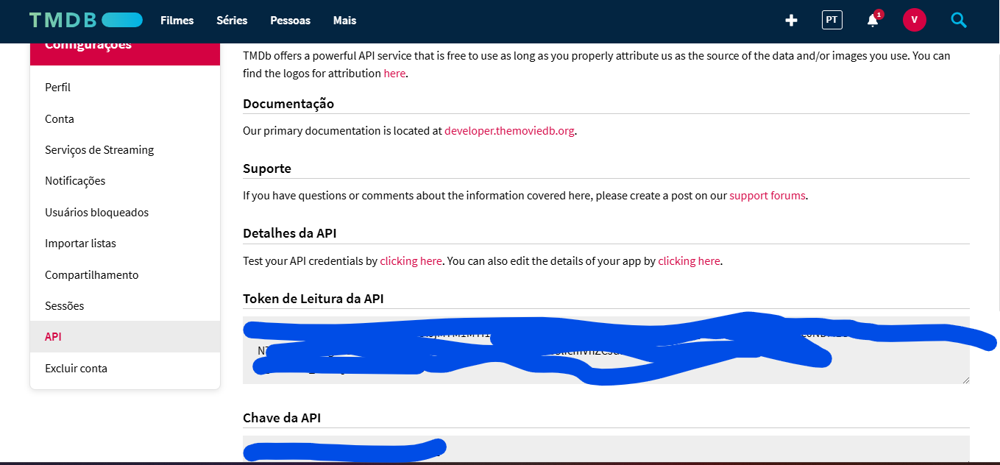

Testei as credenciais fazendo um arquivo local, como o exemplo do arquivo:

<a href="../Sprint-7/Exercicios/TMDB/tmdb.py">Script utilizado</a>

Fiz algumas modificações utilizando um <code>.env</code> para não expor as credenciais, utilizei o <code>git ignore</code> para não subir para o GitHub.

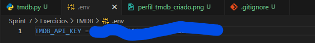

Ao executar, consegui o retorno com o seguinte resultado:

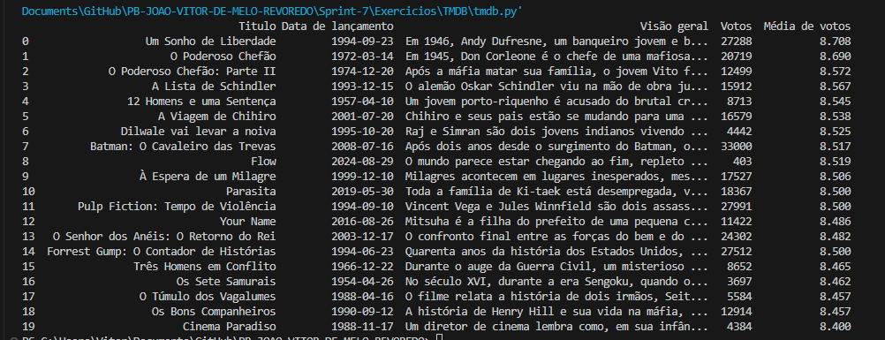

<h2>Certificados</h2>

Essa Sprint não teve cursos AWS, fiz alguns cursos pela Udemy para me aprofundar no assunto.

<h2>Comentários Finais</h2>

A sprint foi importante para realizar a geração de dados simulados, manipulação com Spark. As transformações feitas forneceram bons insights para o processamento de dados na camada Trusted, além de solidificar o entendimento do fluxo de dados para etapas posteriores no projeto.

