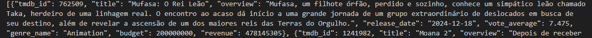
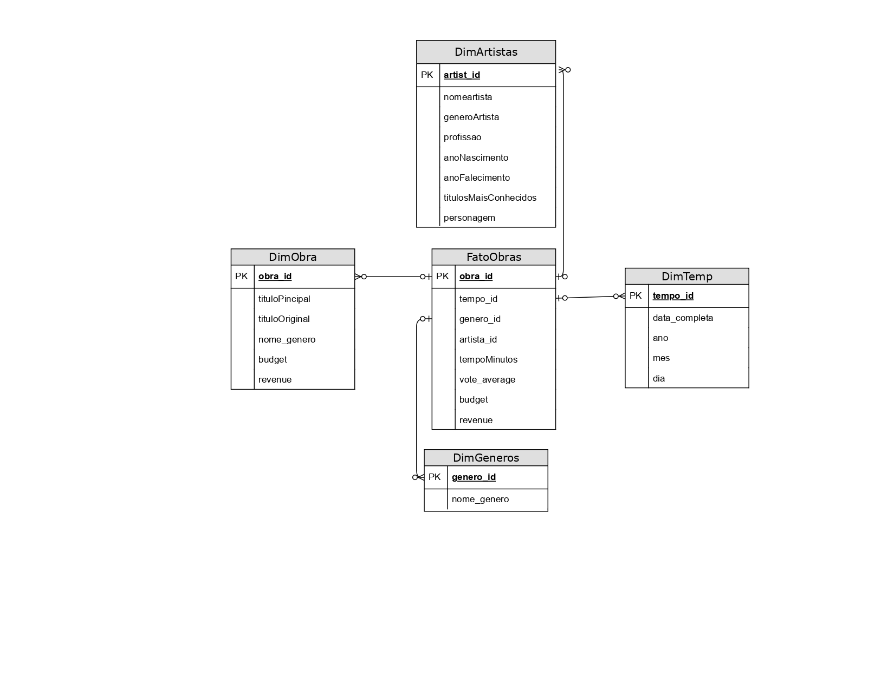
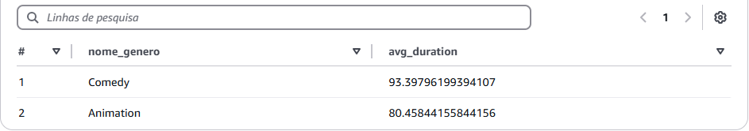

<h1>Desafio da Sprint 9 - Modelagem de Dados na Camada Refined</h1>

O objetivo desta etapa foi organizar e estruturar os dados confiáveis da Trusted Zone para criar uma camada Refined no Data Lake, pronta para análises e visualizações. Realizei a modelagem multidimensional para facilitar consultas analíticas e estruturar os dados no formato PARQUET, otimizados para uso no Amazon QuickSight.

<h2>Ferramentas e Tecnologias</h2>

As ferramentas e tecnologias utilizadas foram:

<ul>
  <li><strong>AWS Glue:</strong> Para transformação e modelagem de dados em larga escala.</li>
  <li><strong>Amazon S3:</strong> Para armazenamento eficiente dos dados refinados, seguindo particionamento estratégico para consultas analíticas.</li>
  <li><strong>Amazon Athena:</strong> Para validação e testes de queries nos dados refinados.</li>
  <li><strong>Apache Spark:</strong> Usado nos jobs do Glue para processar e transformar os dados da Trusted Zone em dados modelados para a Refined Zone.</li>
</ul>

<h2>Ajustes em Etapas Anteriores</h2>

Tive que refazer alguns passos das etapas anteriores:

<h3>Função Lambda</h3>

A busca dos filmes na função Lambda estava trazendo os filmes sem especificar o gênero no JSON. Para facilitar a separação dos filmes na camada Refined, reestruturei a função para incluir o gênero corretamente:

Resultado do ajuste:

<a href="../../Sprint-7/Desafio/lambda_function.py">Função Lambda Ajustada</a>

<h3>Camada Trusted</h3>

Na camada Trusted, precisei refazer o tratamento dos dados provenientes do arquivo CSV, pois ele continha muitos dados duplicados que não eram úteis para minha análise. Realizei um drop duplicate com base no ID e removi colunas completamente nulas para garantir a integridade dos dados confiáveis:

Como precisei refazer a função Lambda, reexecutei o processamento do AWS Glue para processar a camada Trusted corretamente:

<a href="../../Sprint-8/Desafio/processamento_csv.py">Processamento CSV Ajustado</a> 
<a href="../../Sprint-8/Desafio/processamento_tmdb.py">Processamento TMDB Ajustado</a>

Além disso, ajustei o caminho da Camada Trusted para atender ao formato solicitado:

<h2>Estrutura e Modelagem dos Dados</h2>

A modelagem foi desenvolvida para responder a perguntas analíticas sobre os gêneros Comédia e Animação. Os dados foram organizados em uma estrutura multidimensional baseada em métricas e dimensões específicas, seguindo os princípios de modelagem em estrela.

<ul>
  <li><strong>Métricas e Dimensões Incluídas:</strong>
    <ul>
      <li>Dimensões: artistas, anos, gêneros, duração.</li>
      <li>Métricas: número de votos, avaliação média, tempo médio de duração, entre outros.</li>
    </ul>
  </li>
  <li><strong>Particionamento:</strong>
    <ul>
      <li>Os dados foram particionados estrategicamente no S3 para permitir maior eficiência em consultas no Athena e QuickSight.</li>
    </ul>
  </li>
</ul>

<h2>Passo a Passo do Desafio</h2>

Para processar e modelar os dados, realizei os seguintes passos:

<ol>
  <li>Carregamento dos dados confiáveis da Trusted Zone.</li>
  <li>Transformação dos dados no Apache Spark para atender ao modelo dimensional.</li>
  <li>Gravação dos dados refinados no formato PARQUET na Refined Zone do S3, utilizando a estrutura:</li>
  <pre><code>s3://vitor-data-lake/Refined/PARQUET/&lt;tabela&gt;/&lt;ano&gt;/&lt;mês&gt;/&lt;dia&gt;</code></pre>
</ol>

<h2>Modelagem Dimensional (Star Schema)</h2>

Fiz a modelagem dos meus dados para estruturar de forma intuitiva e eficiente, visando facilitar as consultas e análises dos dados.

<a href="modelagem.drawio.pdf">Modelo de Dados - Camada Refined (PDF)</a>

<h2>Dimensões e Tabela Fato</h2>

<h3>Dimensão Artista</h3>

Criação de uma tabela Dimensão para artistas (atores/diretores), com informações como nome, profissão e outros atributos relevantes.

<h3>Dimensão Tempo</h3>

Criação de uma tabela Dimensão com informações sobre o ano, mês e dia de lançamento de filmes e séries.

<h3>Dimensão Gênero</h3>

Criação da tabela Dimensão de Gêneros, unindo dados dos filmes e séries dos dois conjuntos (CSV e TMDB).

<h3>Dimensão Obra</h3>

Criação da tabela Dimensão de Obras (filmes/séries), com informações detalhadas como título e gênero, unindo dados dos dois conjuntos de dados (CSV e TMDB).

<h3>Tabela Fato</h3>

Criação da tabela Fato com as métricas e a associação das chaves das dimensões (Tempo, Gênero e Artista), fornecendo uma visão detalhada de cada obra, incluindo o tempo de duração e a avaliação do público.

<h3>Evidências da Execução e Resultados Gerados</h3>
<ul>
  <li>Os dados foram processados e armazenados no S3:</li>
  
  
  
  
  
</ul>

<h2>Perguntas Respondidas</h2>

Pensei em novas perguntas para responder com os dados modelados, que poderão ser respondidas nas análises subsequentes:

<ol>
  <li>Quais são os artistas com maior número de participações em obras, agrupados por gênero?</li>
  <li>Qual o tempo médio de duração dos filmes em cada gênero?</li>
  <li>Quais filmes de Comédia e Animação têm as melhores avaliações?</li>
  <li>Quantos títulos foram lançados em cada ano?</li>
  <li>Qual gênero tem maior número de títulos com duração superior a 120 minutos?</li>
  <li>Quais anos apresentaram o maior número de lançamentos?</li>
  <li>Como a nota média dos títulos de determinado gênero está relacionada ao tempo de duração?</li>
  <li>Quais títulos têm os melhores desempenhos considerando a avaliação e duração?</li>
  <li>Quais artistas participaram de mais títulos conhecidos nos gêneros?</li>
  <li>Quais anos foram mais significativos em termos de lançamento e avaliação?</li>
  <li>Quais Titulos têm maior avaliação média no gênero Animação? </li>
  <li>Qual é a duração média de animações lançadas por ano?</li>
</ol>

<h2>Queries para Responder as Perguntas</h2>

Criei um arquivo com as perguntas e as queries que testei no Athena para respondê-las:

<a href="queries.txt">Queries SQL</a>

<h2>Catalogação e Consultas no Athena</h2>

Após gravar os dados no S3, utilizei o AWS Glue Crawler para catalogar as tabelas e validar o modelo multidimensional. As tabelas foram disponibilizadas para consulta no Amazon Athena:

As queries realizadas confirmaram a precisão dos dados e a organização conforme esperado.

<h2>Exemplos de Resultados das Pesquisas no Athena</h2>

"Quais são os artistas com maior número de participações em obras, agrupados por gênero?"

"Qual o tempo médio de duração dos filmes em cada gênero?"

<h2>Conclusão</h2>

Com o processamento e a modelagem bem-sucedidos nesta etapa, os dados na Refined Zone estão prontos para serem visualizados no Amazon QuickSight, atendendo a perguntas analíticas e oferecendo insights estratégicos sobre os gêneros Comédia e Animação.

